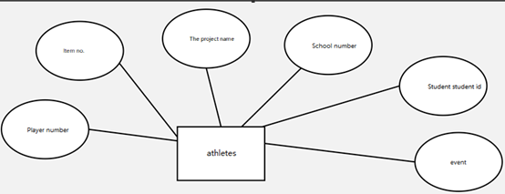

# Lab3 Blog

(Blog link of the team leader⬆)

==Put the link on==

## Team Gathering

### Team Members

| Name | Skills | Programming Interests | Role | STU Number |
|--:|:---:|:---:|:---:|:---:|
|[Member]|[Skill]|[Interests]|[Role]|[STU Number]|
|[Member]|[Skill]|[Interests]|[Role]|[STU Number]|
|[Member]|[Skill]|[Interests]|[Role]|[STU Number]|
|[Member]|[Skill]|[Interests]|[Role]|[STU Number]|
|[Member]|[Skill]|[Interests]|[Role]|[STU Number]|
|[Member]|[Skill]|[Interests]|[Role]|[STU Number]|
|[Member]|[Skill]|[Interests]|[Role]|[STU Number]|
|[Member]|[Skill]|[Interests]|[Role]|[STU Number]|
|[Member]|[Skill]|[Interests]|[Role]|[STU Number]|
|[Member]|[Skill]|[Interests]|[Role]|[STU Number]|

==Fill in the Form==

### Team Characteristics

(*Core Competitiveness*)

==Write something here==

### Team Logo

==Need Picture==

### Our Photo

Ten of us!

==Need Picture==

## Start Section

### Project Introduction

(*in one sentence*)
(*CN&EN*)

==Write something here==

### Criteria of individual contribution determination

### Individual Contribution

| Member | Proportion |
|:---:|:---:|
|[Member]|[Proportion]|
|[Member]|[Proportion]|
|[Member]|[Proportion]|
|[Member]|[Proportion]|
|[Member]|[Proportion]|
|[Member]|[Proportion]|
|[Member]|[Proportion]|
|[Member]|[Proportion]|
|[Member]|[Proportion]|
|[Member]|[Proportion]|
| Total | 100% |

(*It is forbidden to make the same score.*)

==Fill in the Form==

## Drip Record

(*点滴记录*)

### Mind Map

==Need Picture==

| Mind Maps |
|:---:|
| |
|Record|
| |
|About Client Side|
| |
|About Management Side|

### Burnout Map

==Need Picture==

### UML

==Check this part carefully pls==

(x) Part XXXX
•	Person in charge: xxx
•	Description:
•	Problems faced by this part:
•	Problems solved:
•	XX design is applied to solve XX problem. One sentence description.
•	Attachment: 

|

### Learning Progress Bar

Member: [member]

| Week | New lines | Cumulative lines | Time spent on learning this week(hours) | Cumulative time spent on learning(hours) | Important growth |
|:---:|:---:|:---:|:---:|:---:|:---:|
| 1 | | | | | |
| 2 | | | | | |

Member: [member]

| Week | New lines | Cumulative lines | Time spent on learning this week(hours) | Cumulative time spent on learning(hours) | Important growth |
|:---:|:---:|:---:|:---:|:---:|:---:|
| 1 | | | | | |
| 2 | | | | | |

Member: [member]

| Week | New lines | Cumulative lines | Time spent on learning this week(hours) | Cumulative time spent on learning(hours) | Important growth |
|:---:|:---:|:---:|:---:|:---:|:---:|
| 1 | | | | | |
| 2 | | | | | |

Member: [member]

| Week | New lines | Cumulative lines | Time spent on learning this week(hours) | Cumulative time spent on learning(hours) | Important growth |
|:---:|:---:|:---:|:---:|:---:|:---:|
| 1 | | | | | |
| 2 | | | | | |

Member: [member]

| Week | New lines | Cumulative lines | Time spent on learning this week(hours) | Cumulative time spent on learning(hours) | Important growth |
|:---:|:---:|:---:|:---:|:---:|:---:|
| 1 | | | | | |
| 2 | | | | | |

Member: [member]

| Week | New lines | Cumulative lines | Time spent on learning this week(hours) | Cumulative time spent on learning(hours) | Important growth |
|:---:|:---:|:---:|:---:|:---:|:---:|
| 1 | | | | | |
| 2 | | | | | |

Member: [member]

| Week | New lines | Cumulative lines | Time spent on learning this week(hours) | Cumulative time spent on learning(hours) | Important growth |
|:---:|:---:|:---:|:---:|:---:|:---:|
| 1 | | | | | |
| 2 | | | | | |

Member: [member]

| Week | New lines | Cumulative lines | Time spent on learning this week(hours) | Cumulative time spent on learning(hours) | Important growth |
|:---:|:---:|:---:|:---:|:---:|:---:|
| 1 | | | | | |
| 2 | | | | | |

Member: [member]

| Week | New lines | Cumulative lines | Time spent on learning this week(hours) | Cumulative time spent on learning(hours) | Important growth |
|:---:|:---:|:---:|:---:|:---:|:---:|
| 1 | | | | | |
| 2 | | | | | |

Member: [member]

| Week | New lines | Cumulative lines | Time spent on learning this week(hours) | Cumulative time spent on learning(hours) | Important growth |
|:---:|:---:|:---:|:---:|:---:|:---:|
| 1 | | | | | |
| 2 | | | | | |

### Experience

==Write something here==

## Video Clip

[Video on Bilibili.com]()

==Complete the link==

